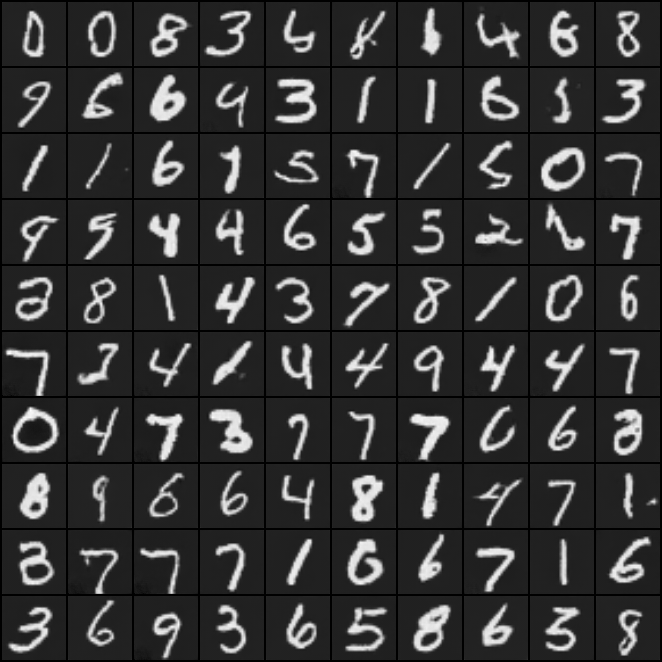
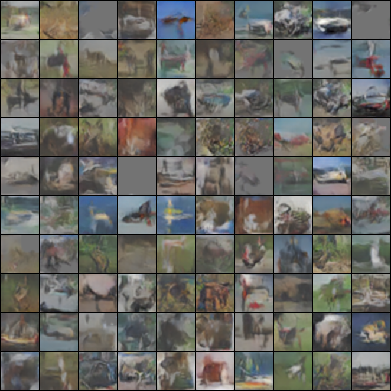
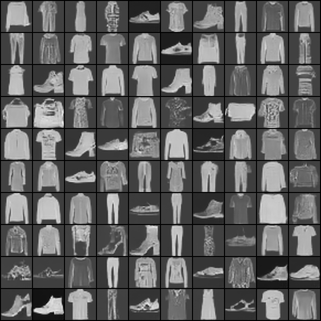

# SNGAN_projection-PyTorch
Pytorch implementation of GANs with spectral normalization and projection discriminator.
## Overview
This repository contains an Pytorch implementation of Spectral Normalization GAN.
With full coments and my code style.

## About SNGAN
If you're new to SNGAN, here's an abstract straight from the paper[1]:

One of the challenges in the study of generative adversarial networks is the insta- bility of its training. In this paper, we propose a novel weight normalization tech- nique called spectral normalization to stabilize the training of the discriminator. Our new normalization technique is computationally light and easy to incorporate into existing implementations. We tested the efficacy of spectral normalization on CIFAR10, STL-10, and ILSVRC2012 dataset, and we experimentally confirmed that spectrally normalized GANs (SN-GANs) is capable of generating images of better or equal quality relative to the previous training stabilization techniques. The code with Chainer (Tokui et al., 2015), generated images and pretrained mod- els are available at [SNGAN](https://github.com/pfnet-research/sngan_projection).

## Dataset 
- MNIST
`python3 main.py --dataset mnist --channels 1`
- FashionMNIST
`python3 main.py --dataset fashion --channels 1`
- Cifar10
`python3 main.py --dataset cifar10 --channels 3`

## Implement
``` python
usage: main.py [-h] [--model {dcgan_projection,dcgan}] [--img_size IMG_SIZE]
               [--channels CHANNELS] [--g_num G_NUM] [--z_dim Z_DIM]
               [--g_conv_dim G_CONV_DIM] [--d_conv_dim D_CONV_DIM]
               [--version VERSION] [--epochs EPOCHS] [--batch_size BATCH_SIZE]
               [--num_workers NUM_WORKERS] [--g_lr G_LR] [--d_lr D_LR]
               [--beta1 BETA1] [--beta2 BETA2]
               [--pretrained_model PRETRAINED_MODEL] [--train TRAIN]
               [--parallel PARALLEL] [--dataset {mnist,cifar10,fashion}]
               [--use_tensorboard USE_TENSORBOARD] [--dataroot DATAROOT]
               [--log_path LOG_PATH] [--model_save_path MODEL_SAVE_PATH]
               [--sample_path SAMPLE_PATH] [--log_step LOG_STEP]
               [--sample_step SAMPLE_STEP] [--model_save_step MODEL_SAVE_STEP]

optional arguments:
  -h, --help            show this help message and exit
  --model {dcgan_projection,dcgan}
  --img_size IMG_SIZE
  --channels CHANNELS   number of image channels
  --g_num G_NUM         train the generator every 5 steps
  --z_dim Z_DIM         noise dim
  --g_conv_dim G_CONV_DIM
  --d_conv_dim D_CONV_DIM
  --version VERSION     the version of the path, for implement
  --epochs EPOCHS       numer of epochs of training
  --batch_size BATCH_SIZE
                        batch size for the dataloader
  --num_workers NUM_WORKERS
  --g_lr G_LR           use TTUR lr rate for Adam
  --d_lr D_LR           use TTUR lr rate for Adam
  --beta1 BETA1
  --beta2 BETA2
  --pretrained_model PRETRAINED_MODEL
  --train TRAIN
  --parallel PARALLEL
  --dataset {mnist,cifar10,fashion}
  --use_tensorboard USE_TENSORBOARD
                        use tensorboard to record the loss
  --dataroot DATAROOT   dataset path
  --log_path LOG_PATH   the output log path
  --model_save_path MODEL_SAVE_PATH
                        model save path
  --sample_path SAMPLE_PATH
                        the generated sample saved path
  --log_step LOG_STEP   every default{10} epoch save to the log
  --sample_step SAMPLE_STEP
                        every default{100} epoch save the generated images and
                        real images
  --model_save_step MODEL_SAVE_STEP
```

## Usage
- MNSIT
`python3 main.py --dataset mnist --channels 1 --version [version] --batch_size [] >logs/[log_path]`
- FashionMNIST
`python3 main.py --dataset fashion --channels 1 --version [version] --batch_size [] >logs/[log_path]`
- Cifar10
`python3 main.py --dataset cifar10 --channels 3 -version [version] --batch_size [] >logs/[log_path]`

## FID
FID is a measure of similarity between two datasets of images. It was shown to correlate well with human judgement of visual quality and is most often used to evaluate the quality of samples of Generative Adversarial Networks. FID is calculated by computing the Fréchet distance between two Gaussians fitted to feature representations of the Inception network.

For the FID, I use the pytorch implement of this repository. [FID score for PyTorch](https://github.com/mseitzer/pytorch-fid)

- MNIST
For the 10k epochs training on MNIST dataset, compare with about 10k samples, I get the FID: 
> 26.023142081893553 
- CIFAR10
<!-- For the 10k epochs training on the CIFAR10 dataset, I get the FID: 
> 86.59441398667008 -->
- FASHION-MNIST
<!-- For the 10k epochs training on the CIFAR10 dataset, I get the FID: 
>  95.55456444871709 -->

> :warning: I dont konw if the FID is right or not, because I cant get the lowwer score like the paper or the other people get it. 
## Network structure
``` python

```
## Result
- MNIST  

- CIFAR10  
<!--  -->
- Fashion-MNIST
<!--  -->
## Reference
1. [SNGAN](https://arxiv.org/abs/1802.05957)

## TODO
- [x] SNGAN implement.
- [ ] DCGAN model with projection discriminator